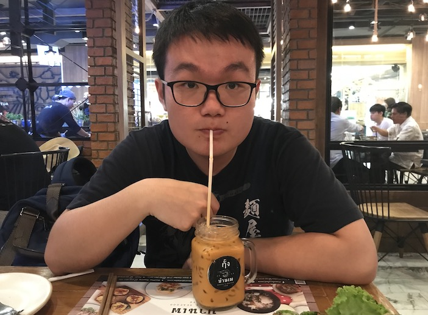

  

Me drinking milk tea at Thailand in March 2019 (I enjoy milk tea very much!)

## A brief self-introduction

I am Lexiao (Sam) Lai, a first-year Ph.D. student at [Columbia IEOR](https://ieor.columbia.edu/). My research interest lies broadly in Operations Research, especially in Optimization. I completed my undergraduate at the [University of Hong Kong](https://www.hku.hk/), majoring in Mathematics and minoring in Finance. And I graduated with First Class Honors. Please refer to my [CV](/Lai%20Lexiao_CV_updated%2008312019.pdf) for more details. I am working with [Prof. C\`edric Josz](https://sites.google.com/site/cedricjosz/) on nonconvex optimization.

## Research Papers
1. Cartee, E., **Lai, L.**, Song, Q., & Vladimirsky, A. (2019). [Time-dependent surveillance-evasion games](https://eikonal-equation.github.io/TimeDependent_SEG/).  (Proceedings of 58th IEEE Conference on Decision and Control)
